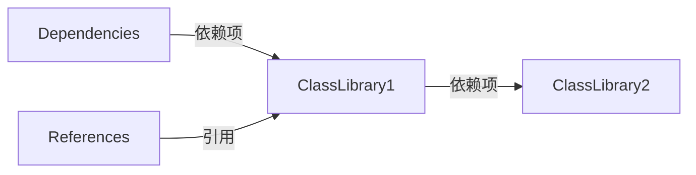

# References And Dependencies
该项目展示了一个使用“引用（References）”和“依赖项（Dependencies）”的区别。  
其中的引用关系如图：

```mermaid
graph LR;
　　ClassLibrary1-->|依赖项|ClassLibrary2;
　　Dependencies-->|依赖项|ClassLibrary1;
　　References-->|引用|ClassLibrary1;
```